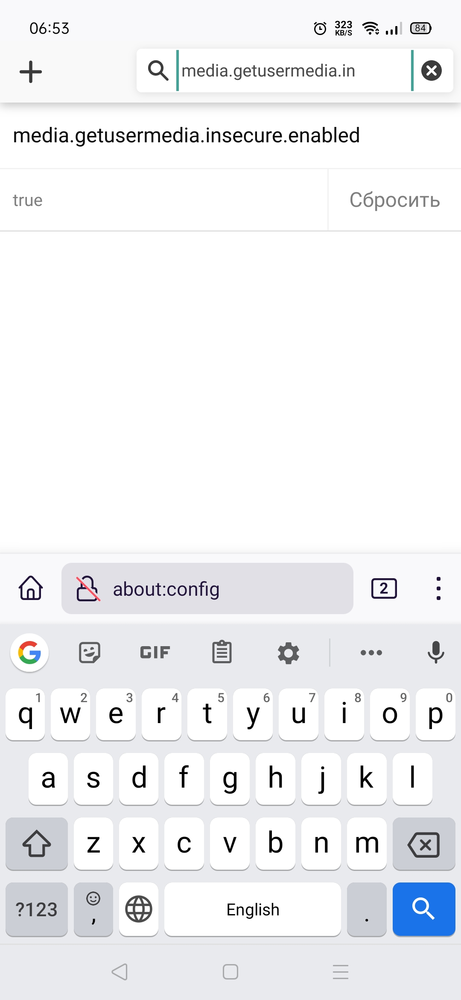

# Misc

## Firewalld help
[Solve no route to host whe invoke host from container by add firewalld rich rule](https://forums.docker.com/t/no-route-to-host-network-request-from-container-to-host-ip-port-published-from-other-container/39063/6)
[Firewalld examples](https://www.rootusers.com/how-to-use-firewalld-rich-rules-and-zones-for-filtering-and-nat/)
```bash
firewall-cmd --permanent --zone=public --list-rich-rules
firewall-cmd --get-default-zone
```

# Development
[node check updates](https://www.npmjs.com/package/npm-check-updates)

[Error:java: invalid source release: 8](https://stackoverflow.com/a/26009627)

[Reactive, Security, Session MongoDb](https://medium.com/@hantsy/build-a-reactive-application-with-spring-boot-2-0-and-angular-de0ee5837fed)

# AAA Login
```
curl -v 'http://localhost:8060/api/login' -H 'Accept: application/json, text/plain, */*' -H 'Content-Type: application/x-www-form-urlencoded' --data 'username=admin&password=admin'
```


```
docker exec -t videochat_postgres_1 pg_dump -U aaa -b --create --column-inserts --serializable-deferrable
```

```
http://localhost:8081/api/user/list?userId=1&userId=-1
```


# Videochat
http://localhost:8081/public/index_old.html

Push down dummy go packages
```
go list -m -json all
```

Test:
```
go test ./... -count=1
```

# Update Go modules
https://github.com/golang/go/wiki/Modules
```bash
go get -u -t ./...
```


## (Re)generate go protobufs
```bash
rm -rf ./chat/proto
mkdir ./chat/proto || true
docker run -it --rm -v $PWD:/ws -w /ws znly/protoc:0.4.0 --go_out=plugins=grpc:chat/proto -I./protobuf ./protobuf/*.proto
```

# Openvidu
```
docker run -p 4443:4443 --rm -e OPENVIDU_SECRET=MY_SECRET openvidu/openvidu-server-kms:2.16.0
```

# Firefox enable video on non-localhost
https://lists.mozilla.org/pipermail/dev-platform/2019-February/023590.html
about:config
media.devices.insecure.enabled

# Mobile firefox enable video on non-localhost



# Validate turn server
Firstly uncomment `TURN_USERNAME_PASSWORD=guest:somepassword` in `openvidu-server` in `docker-compose-infra.template`

Then install on client machine (your PC)
```bash
dnf install coturn-utils
```

Test
```bash
turnutils_uclient -T -u guest -w somepassword <your.public.ip.address>
```

Correct output
```
0: Total connect time is 0
0: 2 connections are completed
1: start_mclient: msz=2, tot_send_msgs=0, tot_recv_msgs=0, tot_send_bytes ~ 0, tot_recv_bytes ~ 0
2: start_mclient: msz=2, tot_send_msgs=3, tot_recv_msgs=3, tot_send_bytes ~ 300, tot_recv_bytes ~ 300
2: start_mclient: tot_send_msgs=10, tot_recv_msgs=10
2: start_mclient: tot_send_bytes ~ 1000, tot_recv_bytes ~ 1000
2: Total transmit time is 2
2: Total lost packets 0 (0.000000%), total send dropped 0 (0.000000%)
2: Average round trip delay 11.500000 ms; min = 11 ms, max = 13 ms
2: Average jitter 0.800000 ms; min = 0 ms, max = 2 ms
```

# Example of usage openvidu api
https://docs.openvidu.io/en/2.16.0/reference-docs/REST-API/#get-openviduapisessionsltsession_idgt
```
curl s -u"OPENVIDUAPP:MY_SECRET" http://localhost:5443/openvidu/api/sessions/chat1 | jq '.'
```

# Run one test
```bash
go test ./... -count=1 -test.v -test.timeout=20s -p 1 -run TestExtractAuth
```