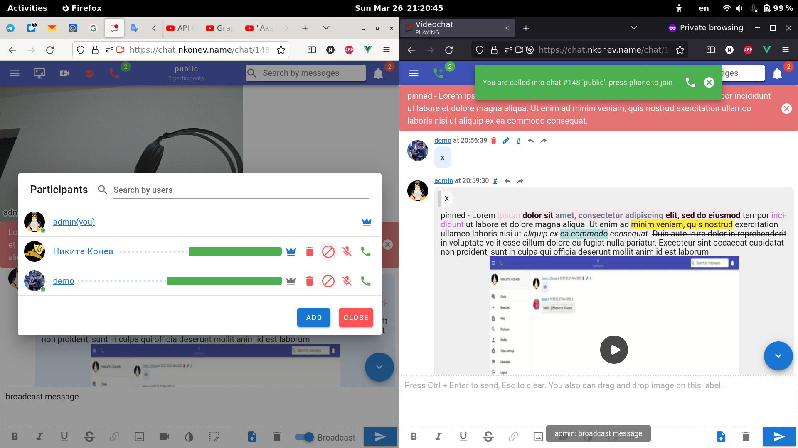

# Videochat
Your open source self-hosted videoconference platform.

# Why
Today Web is ubiquitous. Most of computer's users have web browsers. 
Usually they are modern versions of either Chrome- or Firefox-based browsers.
It seems enough to make video calls. But...

Many of popular communication platforms ignore this fact. 
Typically, they force you to install their Electron-based application on your computer.
Hence, along with web browser you open their heavy application, the resource consumption grows.

Many of popular video platforms store your data on their servers, it means they actually control your data.
This increases risks of data leak, also it makes it possible for them to sell your data, 
to track your actions and watch you. 

Moreover, they can remove all your data in some moment, 
so you can lose your messages, files, discussions, contacts, customers, clients, etc...

They show you annoying or inappropriate ads, you have no option to disable it.

This project offers you a self-hosted solution, that you can incorporate into your infrastructure, 
so you will possess your data and can you apply your own security policies, 
whether to expose this service to the Internet or not, to hide it behind your corporate VPN and so on.

# Screenshots
Click on image to open a screenshot gallery.

# Features:
* Calls from PC to Mobile and vise versa.
* Well-integrated video calls into entire platform UI, no separated video rooms, text chats, etc...
* No installation on client's machine - only modern browser with video camera or microphone required.
* Tested in Firefox and Chrome.
* Multiple cameras support - an user can transmit video simultaneously from several web cameras connected to their computer.
* Multiple devices support - an user can use several devices simultaneously (e. g. smartphone / PC / Laptop / ...).
* Screen [sharing](./screenshots.md#screen-sharing).
* Video recording, recordings are saved to Files.
* File [sharing](./screenshots.md#chat-files).
* [Muting, kicking](./screenshots.md#videoconference-and-participant-management) video participants.
* Calling to user to [invite](./screenshots.md#inviting-user-to-videoconference) his or her to video conference.
* User is [speaking indication](./screenshots.md#user-is-speaking-indication-green-nickname-and-microphone).
* Persistent text chats with simple formatting. Messages are persisted in the chat.
* [Tet-a-tet](./screenshots.md#open-tet-a-tet-chat) private chats for two.
* Notifications about `@mention`, `@all`, `@here` and missed video calls.
* Pinned messages.
* Horizontal scaling, including video server itself thanks to Livekit.
* No sticky sessions required.
* Supports [login](./screenshots.md#login) through OpedID Connect providers: Facebook, VK.com, Google, Keycloak. Not required can be disabled.
* LDAP login integration.
* Internationalization: English and Russian UI.
* Firewall friendly: only two ports for WebRTC are needed (TURN, WebRTC).
* Simple setup with docker swarm or docker-compose.
* No vendor lock on cloud provider.
* Familiar infrastructure - PostgreSQL, RabbitMQ, Redis, Jaeger, Minio, Traefik, NGINX.
* Self-contained frontend bundle without any CDN downloads - it can work in a closed network without internet access.
* No need to edit `/etc/hosts` for local demo installation or development.

# Try
Demo server [installation](https://chat.nkonev.name/)

# Installation
* Use docker-swarm [files](./deploy)
* Replace `api.site.local` with your actual hostname, remove 8080 if need
* Configure ssl in `deploy/traefik_conf/traefik.yml`
* Open ports (if need) to Traefik and Livekit, described in `deploy/docker-compose-infra.template.yml`
